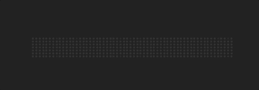

# react-moving-dottext

This `React` component mimics the `LED` signage moving text display.
You can customize the color, size, length and speed.
Currently, it only supports alphanumeric characters but can be easily extended.

This is a fun coding exercise in time for the holiday!

# Usage



```javascript
import DotText from './components/DotText'

const HolidayGreetings = () => {
    return (
        <div style={styles.container}>
            <DotText 
            text="Merry Christmas and Happy New Year" 
            play={true} 
            length={60}
            />
        </div>
    )
}

const styles = {
    container: {
        position: 'relative',
        height: '100vh',
        display: 'flex',
        justifyContent: 'center',
        alignItems: 'center',
    }
}

export default HolidayGreetings
```

# Development

This React project is bootstrapped using [Vite](https://vitejs.dev/guide/).

```sh
$ npm create vite@latest
```

To successfully install [Storybook](https://storybook.js.org) in a `React+Vite` project, please use the command below:

```sh
$ npx sb@next init --builder=vite
```

The explanation is written in this [blog post](https://storybook.js.org/blog/first-class-vite-support-in-storybook/).).

# Setup

Clone the repository, install the dependencies and run

```sh
$ git clone https://github.com/supershaneski/react-moving-dottext.git myproject

$ cd myproject

$ npm install

$ npm start
```

Open your browser to `http://localhost:5173/` or some other port depending on the availability.

To run Storybook

```sh
$ npm run storybook
```

Your browser will open to `http://localhost:6006`.